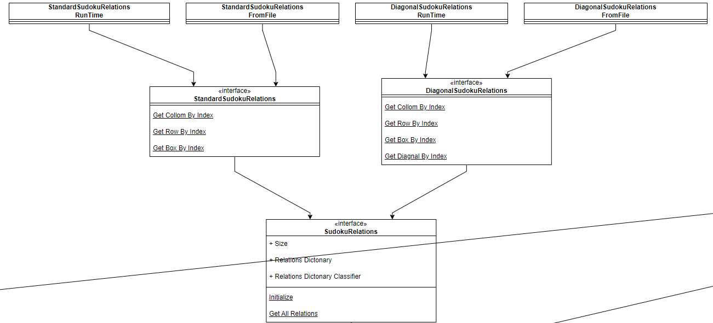

[//]: # (# Sudoku_Solver_Project)


# Sudoku_Solver_Project

## Overview

This project aims to develop a Sudoku Solver application using C# with a focus on implementing constraint propagation and naked pairs strategies to efficiently solve Sudoku puzzles.

## Features

- **Constraint Propagation:** Utilizes constraint propagation techniques to reduce the search space and narrow down possible values for each cell based on the constraints imposed by the Sudoku rules.

- **Naked Pairs:** Implements the naked pairs strategy to identify pairs of numbers that are confined to specific cells within a unit (row, column, or block), allowing for more precise elimination of candidate values.

## Installation

1. Clone the repository to your local machine:

    ```bash
    git clone https://github.com/morfishman/Sudoku_Solver_Project.git
    ```

2. Navigate to the project directory:

    ```bash
    cd Sudoku_Solver_Project
    ```

3. Build the solution using Visual Studio or the .NET CLI:

    ```bash
    dotnet build
    ```

4. Run the application:

    ```bash
    dotnet run
    ```

## Constraint Propagation

Constraint propagation is a technique used to iteratively apply constraints to reduce the search space of a problem. In the context of Sudoku solving, constraint propagation involves continuously updating the possible values for each cell based on the constraints imposed by the existing values in the puzzle.

For example, if a cell already has a value assigned to it, that value must be removed from the candidate values of all other cells in the same row, column, and block.

## Naked Pattern

Naked patterns refer to sets of candidate values that are confined to a specific subset of cells within a unit (row, column, or block). When naked patterns are identified, these candidate values can be eliminated from the candidate lists of other cells within the same unit.

For instance, if a row contains three cells with candidate values {1, 4}, {1, 4, 7}, and {4, 7}, respectively, and no other cells in the row contain the values 1 or 4, then the values 1 and 4 must be assigned to the first two cells, leaving the third cell with only the candidate value 7.

The naked pattern strategy is an extension of the naked pairs strategy, where instead of pairs, it identifies sets of three or more cells with the same subset of candidate values. It's worth noting that implementing the naked pattern strategy can be computationally intensive and may not be as efficient as other techniques, especially when using bitwise operations.


## Class Diagram





## Usage

Upon launching the application, users can choose to solve a Sudoku puzzle by selecting the appropriate option from the menu. They will be prompted to input the Sudoku puzzle board, and the application will then attempt to solve it using constraint propagation and naked patterns strategies:

```markdown
# Sudoku Solver

Welcome to Sudoku Solver!

Choose an option:

1. Solve Sudoku
2. Exit

Enter your choice: 1

Enter the Sudoku board:
5 3 0 0 7 0 0 0 0
6 0 0 1 9 5 0 0 0
0 9 8 0 0 0 0 6 0
8 0 0 0 6 0 0 0 3
4 0 0 8 0 3 0 0 1
7 0 0 0 2 0 0 0 6
0 6 0 0 0 0 2 8 0
0 0 0 4 1 9 0 0 5
0 0 0 0 8 0 0 7 9

Solving Sudoku...

Sudoku Board Solved:

5 3 4 | 6 7 8 | 9 1 2
6 7 2 | 1 9 5 | 3 4 8
1 9 8 | 3 4 2 | 5 6 7
---------------------
8 5 9 | 7 6 1 | 4 2 3
4 2 6 | 8 5 3 | 7 9 1
7 1 3 | 9 2 4 | 8 5 6
---------------------
9 6 1 | 5 3 7 | 2 8 4
2 8 7 | 4 1 9 | 6 3 5
3 4 5 | 2 8 6 | 1 7 9

Sudoku board successfully solved!

Elapsed time: 00:00:00.3456789

---

Welcome to Sudoku Solver!

Choose an option:

1. Solve Sudoku
2. Exit

Enter your choice: 2

Exiting Sudoku Solver. Goodbye!
```

